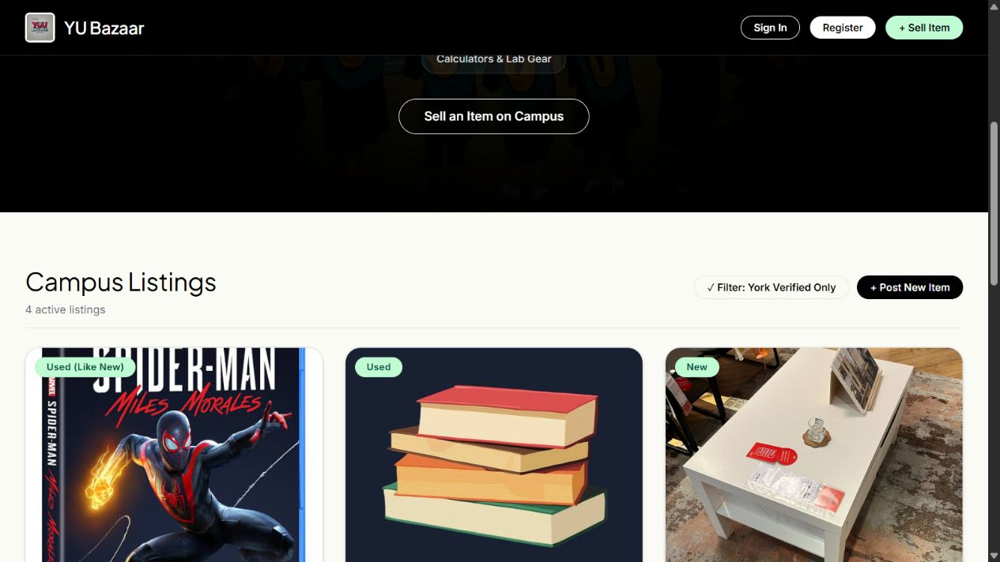
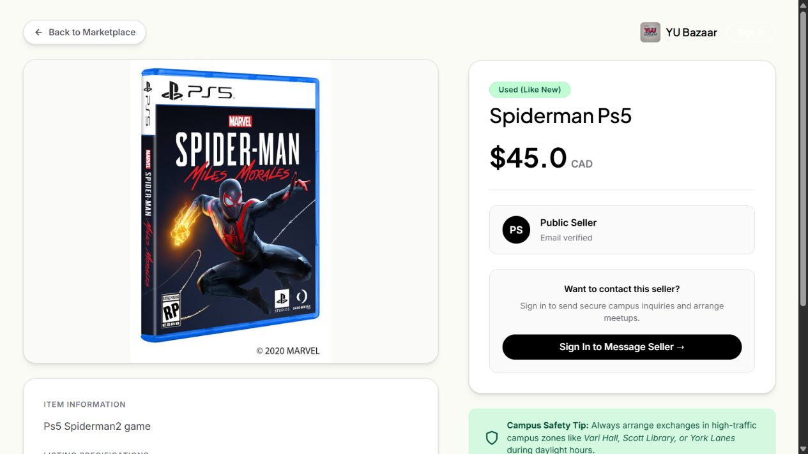
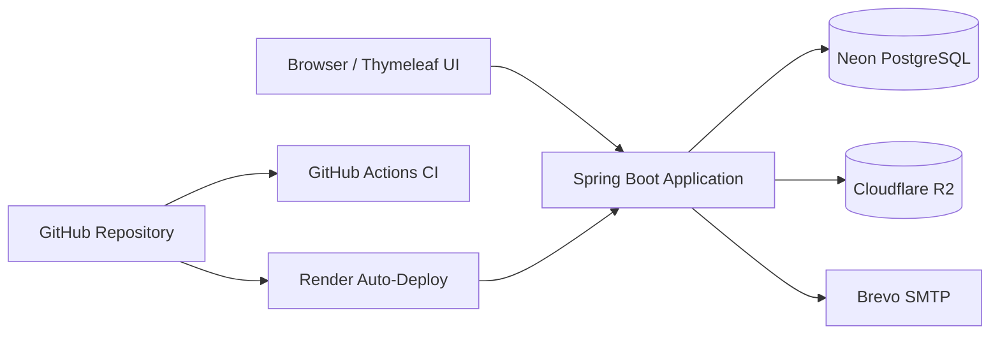

# YU Bazaar

[](https://github.com/souravC01/yu-bazaar/actions/workflows/ci.yml)
[](https://yu-bazaar.onrender.com)
[](https://openjdk.org/projects/jdk/17/)
[](https://spring.io/projects/spring-boot)

YU Bazaar is a production-deployed marketplace built around the York University community. Anyone with a valid email can browse, register, and sell as a **Public Seller**; accounts verified with a York email receive **York Verified Student** status.

The project demonstrates a complete marketplace workflow rather than a static front-end: identity verification, authentication, public listings and photographs, seller inquiries, ownership controls, password recovery, cloud storage, database migrations, automated tests, and continuous deployment.

**Live application:** [yu-bazaar.onrender.com](https://yu-bazaar.onrender.com)

> The free Render instance may take about a minute to wake after a period of inactivity.

## Explore the MVP

The fastest reviewer path is:

1. Open the [live marketplace](https://yu-bazaar.onrender.com) and browse the four portfolio listings.
2. Open a product to inspect its photograph, seller tier, listing details, and inquiry path.
3. Select **Sign In**, then choose **Try the read-only demo**.
4. Visit the demo profile and protected seller flows without changing production data.
5. Optionally register with another email to experience OTP verification and account recovery.

### Recruiter demo

| Field | Value |
| --- | --- |
| Email | `demo@yubazaar.app` |
| Password | `Demo@YuBazaar2026` |
| Access | Read-only |

These credentials are intentionally public. The demo can browse, search, view products, and inspect its profile, but it cannot create or delete listings, contact sellers, change its password, or perform other write operations.

## Production Screens

### Marketplace listings



### Product details



## What the Project Demonstrates

- Public browsing, search, filters, and live search suggestions
- Registration with any valid email and a distinct York verification tier
- DOB-based eligibility validation requiring users to be at least 16
- Ten-minute email verification codes with a sixty-second resend cooldown
- Recovery for users who leave registration before entering their OTP
- BCrypt password hashing and session-backed authentication
- Expiring, single-use password-reset links with replay protection
- Listing creation with validated metadata and uploaded photographs
- Public image delivery backed by Cloudflare R2 object storage
- Seller inquiries delivered by email with abuse controls
- Owner-only listing deletion and profile-based listing management
- Protected, read-only demo access for portfolio reviewers
- Responsive, server-rendered pages built with Thymeleaf

## Verification Model

YU Bazaar is public by design. Verification establishes the seller tier; it does not restrict who may browse the marketplace.

| Account | Requirement | Marketplace status |
| --- | --- | --- |
| Public seller | Verify any valid email | Public Seller |
| York community member | Verify a York email address | York Verified Student |
| Recruiter demo | Use the published demo credentials | Read-only Demo |

Both seller tiers can create listings after email verification. The York badge communicates institutional email ownership without presenting public sellers as York-affiliated.

## Architecture

The MVP intentionally uses one Spring Boot service. This keeps deployment and operations understandable while preserving clear application boundaries for controllers, policies, persistence, email, and image storage.



### Request flow

- Spring MVC controllers receive browser requests and render Thymeleaf pages.
- Spring Security and application policies enforce authenticated, owner-only, and demo-read-only actions.
- Spring Data JPA persists accounts and listings to PostgreSQL; Flyway owns schema evolution.
- The storage abstraction writes production photographs to R2 and uses local storage during development.
- Brevo sends OTP, password-reset, listing, and seller-inquiry emails.
- Render builds the Docker image, checks application health, and deploys changes from `main`.

## Technology

| Area | Technology |
| --- | --- |
| Application | Java 17, Spring Boot 3.3, Spring MVC |
| UI | Thymeleaf, HTML, CSS, JavaScript |
| Authentication | Spring Security, BCrypt, server sessions |
| Persistence | Spring Data JPA, PostgreSQL, Flyway |
| Local development | H2, local image storage, Maven Wrapper |
| Production storage | Neon PostgreSQL, Cloudflare R2 |
| Email | Spring Mail with Brevo SMTP |
| Delivery | Docker, Render Blueprint, GitHub Actions |

## Run Locally

### Prerequisites

- Java 17
- Git

### Start the application

```powershell
git clone https://github.com/souravC01/yu-bazaar.git
cd yu-bazaar
.\mvnw.cmd spring-boot:run
```

Open [localhost:8080](http://localhost:8080). The default `dev` profile uses an in-memory H2 database, disables outbound email, and stores uploaded images locally, so no cloud credentials are required.

On macOS or Linux, run `./mvnw spring-boot:run` instead.

## Test

```powershell
.\mvnw.cmd test
```

The automated suite covers route protection, password hashing, both verification tiers, OTP expiry and resend cooldowns, interrupted-registration recovery, DOB and 16+ validation, single-use password resets, replay rejection, inquiry limits, listing validation and ownership, demo restrictions, profile filtering, image storage, public photograph delivery, and placeholder rendering.

## Production Configuration

Copy [`.env.example`](.env.example) as a reference for the production environment. It documents the required configuration groups without containing credentials:

- application base URL and active Spring profile
- PostgreSQL connection details
- SMTP sender and authentication settings
- R2 endpoint, bucket, and access credentials

Production infrastructure is declared in [`render.yaml`](render.yaml). Database changes belong in versioned Flyway migrations under [`src/main/resources/db/migration`](src/main/resources/db/migration).

Never commit real passwords, SMTP credentials, database URLs, or object-storage keys.

## Security and Reliability

- Passwords are hashed with BCrypt and never stored in plain text.
- Verification codes expire, have resend throttling, and can be recovered after an interrupted signup.
- Password-reset tokens are hashed, expire after use, and reject replay attempts.
- Listing mutations are restricted to their owners; demo-account mutations are denied centrally.
- Uploaded images are served through application-controlled public routes rather than exposing storage credentials.
- Registration rejects malformed, future, implausible, and under-16 dates of birth with user-facing errors.
- Health checks, graceful shutdown, database connection limits, and automated CI support the free production deployment.

## MVP Scope

YU Bazaar is a polished portfolio MVP, not a commercial transaction platform. Payments, escrow, delivery, real-time chat, moderation dashboards, and microservices are intentionally out of scope. Buyers contact sellers through controlled email inquiries and arrange exchanges independently.

This scope keeps the project focused on a reliable end-to-end marketplace experience and avoids infrastructure that the current product does not need.

## Project History and Attribution

The original YU Bazaar application was developed by a four-person student team and is hosted in the [course repository](https://github.com/hvpham-yorku/YuBazaar).

This independently maintained portfolio edition was created from a sanitized snapshot of the instructor-hosted repository, which remains unchanged. It preserves the original contributors' credit while evolving the local course application into a publicly deployed cloud application.

My verified contributions to the original team project included:

- Registration and recovery email notifications
- Password recovery using generated recovery codes
- York University email OTP verification
- Item search and live search suggestions
- Fixes to the item-listing and home-page workflow

Subsequent portfolio work added the production architecture, verification tiers, security hardening, cloud media storage, protected demo experience, automated tests, responsive interface, and deployment workflow described above.

## License

Licensed under the MIT License. See [LICENSE](LICENSE).
