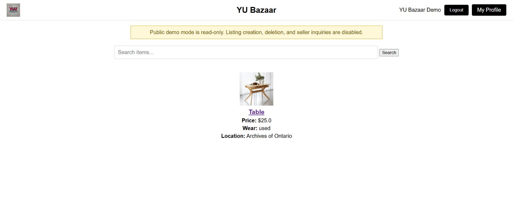
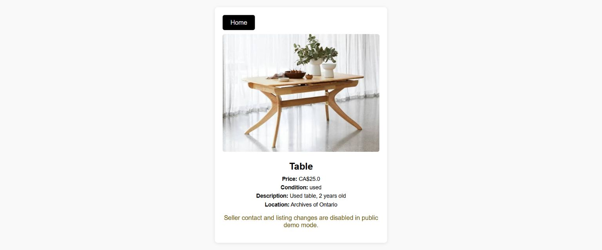

# YU Bazaar

[](https://github.com/souravC01/yu-bazaar/actions/workflows/ci.yml)

YU Bazaar is a marketplace application created for York University students to list, discover, and inquire about items available within the campus community.

This repository is an independently maintained portfolio edition of a four-person course project. It was created from a sanitized snapshot of the instructor-hosted course repository, which remains unchanged, and evolves the original local application into a publicly deployed cloud application.

**Live application:** [yu-bazaar.onrender.com](https://yu-bazaar.onrender.com)

The free Render instance may take about a minute to wake after a period of inactivity.

## Public Demo

Recruiters and reviewers without a York University email can use the restricted production demo account:

- **Email:** `demo@yubazaar.app`
- **Password:** `Demo@YuBazaar2026`

The credentials are intentionally public. Demo access is read-only: visitors can browse listings, search, view product details, and inspect the profile, but cannot create or delete listings, contact sellers, or reset the demo password.

## Screenshots

### Marketplace



### Product Details



## Current Status

The portfolio edition is deployed and its primary production workflow has been verified: York email registration, OTP delivery, account verification, sign-in, listing creation, and persistent image upload. Automated tests also cover authentication boundaries, password recovery, listing ownership, media delivery, and owner-only deletion.

## Features

- York University email registration with one-time verification codes
- BCrypt password hashing and session-backed authentication
- Expiring, single-use password reset links
- Marketplace listings with search and live suggestions
- Private image storage in Cloudflare R2
- Seller inquiries delivered by email
- Owner-only listing deletion and media cleanup
- Responsive server-rendered pages built with Thymeleaf

## Technology

- Java 17
- Spring Boot and Spring MVC
- Spring Data JPA
- Spring Security
- Thymeleaf
- PostgreSQL in production
- H2 for local development and isolated tests
- Flyway database migrations
- Cloudflare R2-compatible object storage
- AWS SDK for Java 2.x
- Docker and Render Blueprint deployment
- Maven

## Original Project

The original YU Bazaar application was developed by a four-person student team and is hosted in the [course repository](https://github.com/hvpham-yorku/YuBazaar).

My verified contributions to the original project included:

- Registration and recovery email notifications
- Password recovery using generated recovery codes
- York University email OTP verification
- Item search and live search suggestions
- Fixes to the item-listing and home-page workflow

All original contributors retain credit for the team project. This repository preserves the project's MIT license and clearly separates the original coursework from subsequent portfolio improvements.

## Portfolio Modernization

After the course ended, I created this independent repository and prepared the application for continued development and public deployment. My modernization work includes:

- Replacing the temporary course database with Neon PostgreSQL and versioned Flyway migrations
- Securing authentication with BCrypt, protected routes, expiring verification codes, and single-use password reset links
- Moving uploaded listing images from local disk to private Cloudflare R2 object storage
- Containerizing and deploying the application on Render with health checks and persistent cloud services
- Configuring branded transactional email delivery through Brevo
- Adding automated coverage for authentication, recovery, listing ownership, deletion, and media delivery

This work preserves the original team's attribution while demonstrating the production engineering completed after the course project.

## Local Development

The default `dev` profile uses an in-memory H2 database and disables external email delivery, so no cloud credentials are required:

```powershell
.\mvnw.cmd spring-boot:run
```

Open `http://localhost:8080` after the application starts.

Register with a `yorku.ca` or `my.yorku.ca` address. In local development, the verification code appears on the verification page and password recovery provides a local reset link instead of sending email. Local data is reset whenever the application restarts.

## Production Configuration

Production uses environment variables rather than committed credentials. Copy `.env.example` into your deployment platform's secret manager and provide the public application URL, Neon PostgreSQL settings, mail settings, and Cloudflare R2 credentials there. Flyway baselines the existing Neon schema at version 1 on its first production connection and manages later migrations normally. Do not commit a populated `.env` file.

Create a private R2 bucket and an API token with object read/write access limited to that bucket. Set `R2_ENDPOINT` to the account-level S3 endpoint shown in Cloudflare, and keep `R2_REGION=auto`. Images remain private in the bucket and are delivered to signed-in users through the application's `/media/{key}` endpoint.

The default `local` storage backend writes to `uploads/`. Set `UPLOAD_DIRECTORY` only when a different local path is needed. The production profile defaults to the `s3` backend.

## Deployment

The repository includes a multi-stage `Dockerfile` and `render.yaml` Blueprint. Render builds the Java 17 image, runs the service as a non-root user, and checks `/actuator/health` before routing traffic. Secret values are entered in the Render dashboard during Blueprint creation and are never stored in the repository.

Production email uses Brevo's STARTTLS relay on port `2525`, which remains available from Render's free web services. Explicit mail timeouts keep registration and password recovery responsive if the email provider is unavailable.

The free Render instance may sleep after inactivity. Neon stores application data and Cloudflare R2 stores uploaded media, so restarts do not lose persistent state.

### Production Architecture

- Render runs the containerized Spring Boot application.
- Neon provides managed PostgreSQL with Flyway-controlled migrations.
- Cloudflare R2 stores private listing images through its S3-compatible API.
- Brevo delivers verification, recovery, listing, and inquiry emails.

## Testing

```powershell
.\mvnw.cmd test
```

The current suite covers route protection, password hashing, verified login, expiring one-time password resets, replay rejection, authenticated listing ownership, owner-only deletion, and uploaded-image delivery.

## License

Licensed under the MIT License. See [LICENSE](LICENSE).
